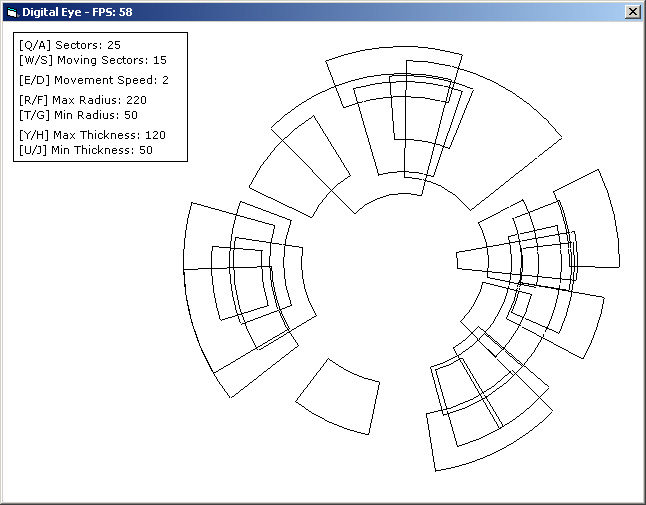



## Digital Eye

### Description

This little baby is just a replication of something i saw on TV once...although the one on TV looked better, but wasn't as random :)
 
### More Info
 
You can adjust several aspects of the segments

Its been heavily optimized, and the code isn't commented much at all :(

Sorry, but i'm sure if you know your stuff you'll be able to make sense of it all :)

             |
---                |---
**Submitted On**   |2004-12-13 13:59:48
**By**             |[shousper](https://github.com/Planet-Source-Code/PSCIndex/blob/master/ByAuthor/shousper.md)
**Level**          |Advanced
**User Rating**    |4.8 (76 globes from 16 users)
**Compatibility**  |VB 5\.0, VB 6\.0
**Category**       |[Graphics](https://github.com/Planet-Source-Code/PSCIndex/blob/master/ByCategory/graphics__1-46.md)
**World**          |[Visual Basic](https://github.com/Planet-Source-Code/PSCIndex/blob/master/ByWorld/visual-basic.md)
**Archive File**   |[Digital\_Ey187285462005\.zip](https://github.com/Planet-Source-Code/shousper-digital-eye__1-59855/archive/master.zip)

### API Declarations

"Sleep" is defined, but is only ever used if you change a few things and enable the feature to change the number of segments :)

